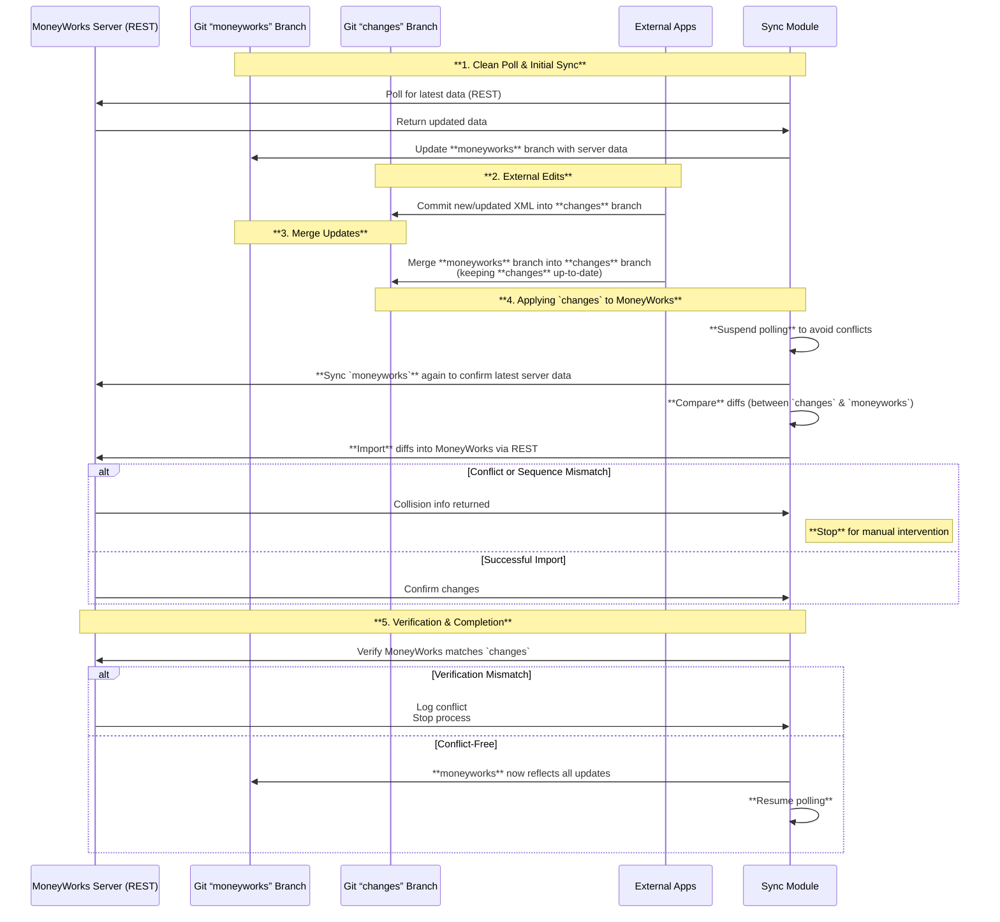

# Process Overview

This module enforces a two-way sync between:

- **MoneyWorks Server** (via REST)
- **`moneyworks`** Git branch (mirrors server data)
- **`changes`** Git branch (external XML submissions)
- **External Apps** (create/edit XML to push into MoneyWorks)

## 1. `moneyworks` Branch

- Mirrors MoneyWorks server data.
- Updated only by this module (polling intervals or post-update).
- Never accept direct external commits here.

## 2. `changes` Branch

- Receives new/modified XML files from external apps.
- Triggers a write workflow if commits are detected.
- External processes will merge the `moneyworks` branch into the `changes`
  branch to keep it up to date.

## 3. Applying `changes` to MoneyWorks

1. **Suspend Polling** to prevent conflicts.
2. **Sync `moneyworks`** to ensure it’s up-to-date.
3. **Compare** diffs between `changes` and `moneyworks`.
4. **Import** diffs into MoneyWorks via REST.
   - Halt if collisions or sequence mismatches appear.

## 4. Verification

- Check MoneyWorks matches the updates from `changes`.
- On mismatch, log conflict and stop.

## 5. Completion

- If conflict-free, `moneyworks` now reflects both server updates and external
  edits.
- Polling resumes.

### Conflict Handling

- Major conflicts require manual intervention before proceeding.

### Summary

A safe, auditable sync flow between MoneyWorks and Git:

- Poll and update `moneyworks`,
- When new commits appear in `changes`, pause polling,
- Insert from `changes` into the MoneyWorks server,
- Verify the changes were applied correctly,
- Resume polling.
